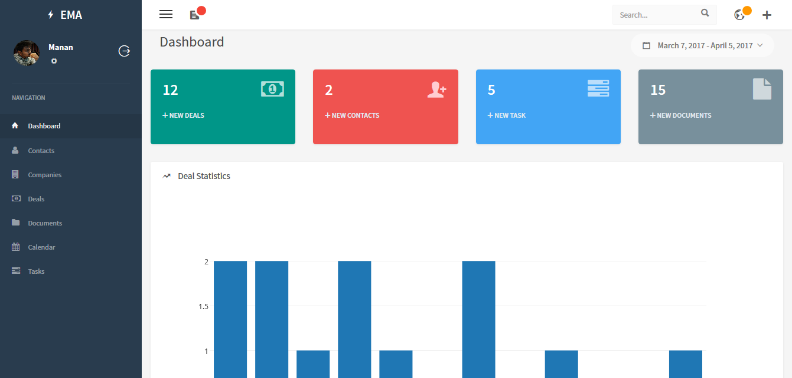
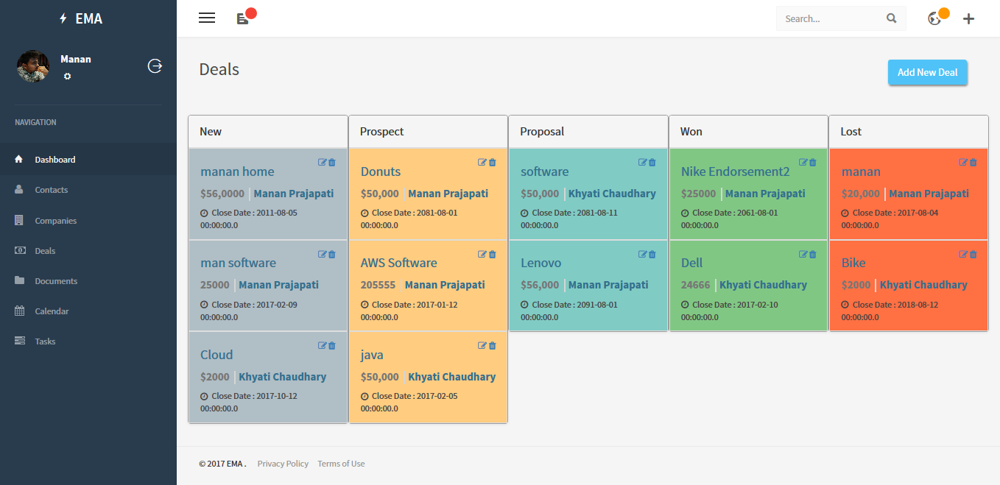
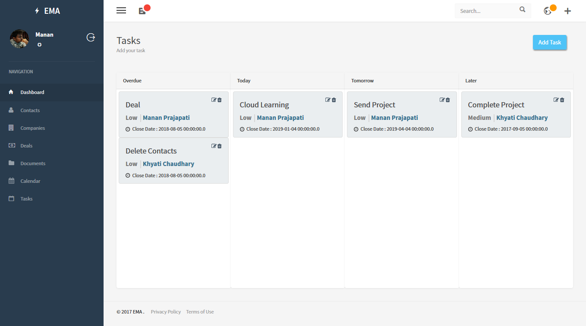
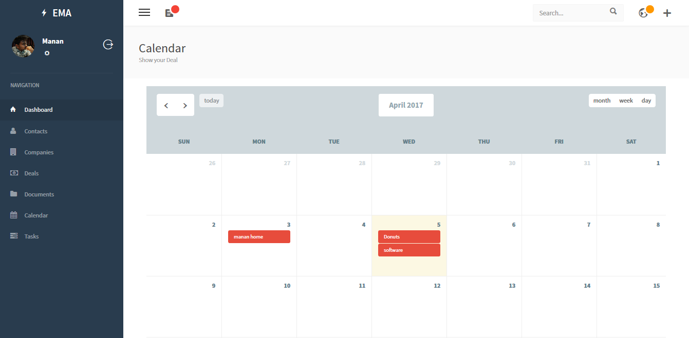
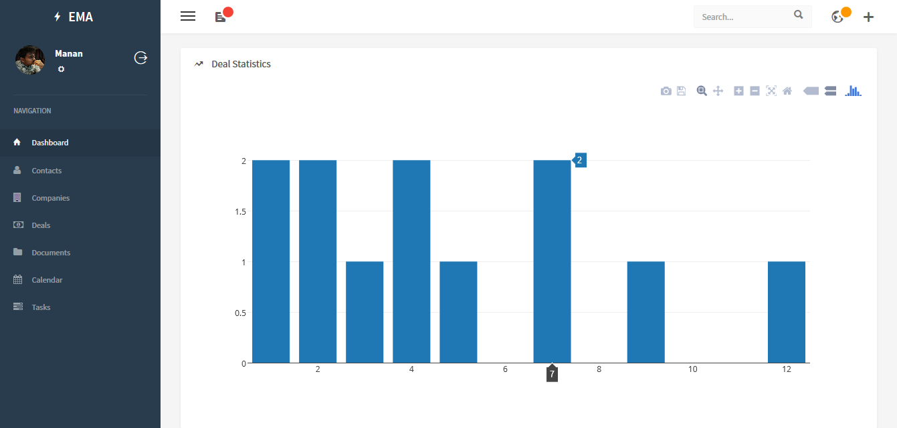

# Enterprise-Monitoring-Agent
“Enterprise Monitoring Agent” is a Web Application for small and medium companies that need to automate processes, connect employees, and gain business insight when they need it. Get the tools you need to manage products, orders, customers, finances, documents and operations. Owner can get into the business to need to reduce costs, stay in compliance, deliver value to your customers, and effectively manage growth. Its a ERP based system made with J2EE spring framework.

## Snapshots
<html>
  
Dashboard

  
  
Deals

  
  
Task

  
  
Calender

  
  
Chart

  
</html>
